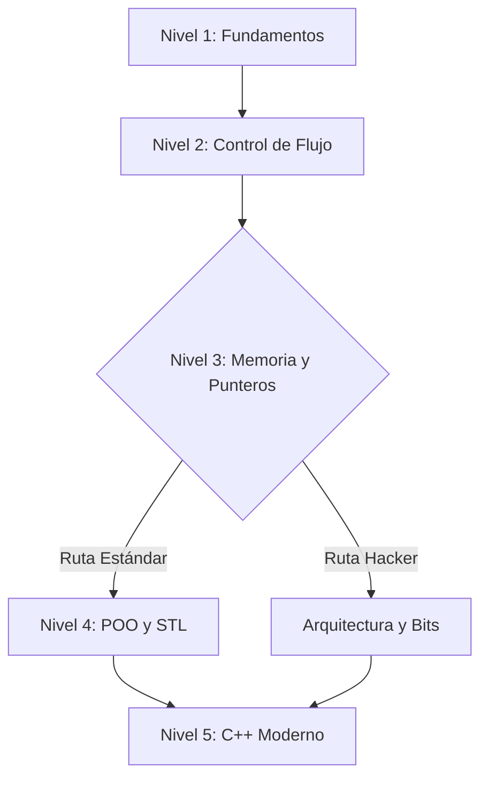

[](https://codespaces.new/)

# Portafolio-C++

## Ejecutar ejercicios en Codespaces (menu interactivo)

En la terminal:

```sh
./menu.sh
```

Nota: `menu.sh` se proporciona con permisos ejecutables por defecto en Codespaces (y `.devcontainer` contiene un `postCreateCommand` como respaldo). Si por alguna razón no puede ejecutarlo, use `bash menu.sh`.

Propósito
---------
Portafolio-C++ es un repositorio público que recopila ejercicios en C++ organizados por niveles de aprendizaje. El objetivo es mostrar implementaciones pedagógicas y autocontenidas de problemas clásicos y modernos a medida que se avanza en el dominio del lenguaje.



<!-- ESTRUCTURA DE ACORDEÓN (COLLAPSIBLE SECTIONS) -->

<details open>
<summary><h2>🟢 Nivel 1: Fundamentos</h2></summary>

| Estado | Ejercicio | Conceptos | Acción |
|---:|---|---|:---|
| ✅ | **Hola Mundo** | `cout`, E/S básica | [📂 Ver Código](./nivel1/hola_mundo.cpp) |
| ✅ | **Suma de dos números** | `cin`, `cout`, aritmética | [📂 Ver Código](./nivel1/suma_dos_numeros.cpp) |
| ✅ | **Tipos de datos** | `sizeof`, `int`, `float`, `double`, `char` | [📂 Ver Código](./nivel1/tipos_de_datos.cpp) |
| ✅ | **Intercambio de variables (temporal)** | asignación, variable temporal | [📂 Ver Código](./nivel1/intercambio_temporal.cpp) |
| ✅ | **Intercambio sin temporal** | aritmética, XOR | [📂 Ver Código](./nivel1/intercambio_sin_temporal.cpp) |
| ✅ | **Par o Impar** | operador `%`, condición | [📂 Ver Código](./nivel1/par_o_impar.cpp) |
| ✅ | **Mayor de dos** | condicionales `if` | [📂 Ver Código](./nivel1/mayor_de_dos.cpp) |
| ✅ | **Mayor de tres** | anidamiento de condicionales | [📂 Ver Código](./nivel1/mayor_de_tres.cpp) |
| ✅ | **Año bisiesto** | lógica de años, condicionales | [📂 Ver Código](./nivel1/anio_bisiesto.cpp) |
| ✅ | **Calculadora simple** | `switch`, operaciones básicas | [📂 Ver Código](./nivel1/calculadora_simple.cpp) |
| ✅ | **Área de un círculo** | PI, fórmula área, `double` | [📂 Ver Código](./nivel1/area_circulo.cpp) |
| ✅ | **Conversor de temperatura** | conversión Celsius↔Fahrenheit | [📂 Ver Código](./nivel1/conversor_temperatura.cpp) |
| 🚧 | **Verificar vocal** | `char`, comparaciones |  |
| 🚧 | **Número positivo/negativo/cero** | comparaciones |  |
| 🚧 | **Días de la semana** | `switch` o arrays |  |
| 🚧 | **Cálculo de descuento** | aritmética condicional |  |
| 🚧 | **Divisibilidad** | operador `%` |  |
| 🚧 | **Ecuación cuadrática** | resolución de $ax^2 + bx + c = 0$ |  |
| 🚧 | **ASCII** | código ASCII, `int(char)` |  |
| 🚧 | **Validación de edad** | comparaciones lógicas |  |

</details>

<details>
<summary><h2>🟡 Nivel 2: Control de Flujo y Arreglos</h2></summary>

| Estado | Ejercicio | Conceptos | Acción |
|---:|---|---|:---|
| 🚧 | **Imprimir 1 al 100** | `for` loop |  |
| 🚧 | **Suma de naturales** | bucles, acumulador |  |
| 🚧 | **Factorial** | bucle, $n!$ |  |
| 🚧 | **Tabla de multiplicar** | bucles anidados |  |
| 🚧 | **Serie Fibonacci** | bucles, secuencia |  |
| 🚧 | **Invertir número** | operaciones aritméticas |  |
| 🚧 | **Suma de dígitos** | módulo y división |  |
| 🚧 | **Números Primos** | algoritmos de prueba |  |
| 🚧 | **Primos en rango** | criba/optimización |  |
| 🚧 | **Patrón de asteriscos** | bucles anidados, formato |  |
| 🚧 | **Pirámide** | alineamiento, bucles |  |
| 🚧 | **Máximo en Array** | recorrido, comparación |  |
| 🚧 | **Mínimo en Array** | recorrido, comparación |  |
| 🚧 | **Promedio** | sumatoria, división |  |
| 🚧 | **Buscar elemento** | búsqueda lineal |  |
| 🚧 | **Contar ocurrencias** | contador en bucle |  |
| 🚧 | **Invertir Array** | swaps in-place |  |
| 🚧 | **Palíndromo (String)** | comparación, índices |  |
| 🚧 | **Contar vocales (String)** | iteración, comparaciones |  |
| 🚧 | **Concatenar cadenas** | manipulación manual de strings |  |

</details>

<details>
<summary><h2>🔴 Nivel 3: Modularidad y Memoria</h2></summary>

| Estado | Ejercicio | Conceptos | Acción |
|---:|---|---|:---|
| 🚧 | **Función Potencia** | exponenciación, bucles |  |
| 🚧 | **Paso por Valor vs Referencia** | parámetros, referencias |  |
| 🚧 | **Punteros Básicos** | `int*`, dirección, desreferencia |  |
| 🚧 | **Aritmética de Punteros** | punteros y arrays |  |
| 🚧 | **Swap con Punteros** | punteros, manipulación de memoria |  |
| 🚧 | **Factorial Recursivo** | recursión |  |
| 🚧 | **Fibonacci Recursivo** | recursión, complejidad |  |
| 🚧 | **Torres de Hanoi** | recursión, llamadas anidadas |  |
| 🚧 | **MCD (Euclides)** | recursión/iteración |  |
| 🚧 | **Suma de Array Recursiva** | recursión aplicada a arrays |  |
| 🚧 | **Longitud de cadena** | `strlen` manual con punteros |  |
| 🚧 | **Copiar cadena** | `strcpy` manual con punteros |  |
| 🚧 | **Memoria Dinámica (new/delete)** | `new`, `delete`, heap |  |
| 🚧 | **Matriz Dinámica** | punteros a punteros, alocación 2D |  |
| 🚧 | **Estructuras (struct)** | definición y acceso a campos |  |
| 🚧 | **Array de Structs** | gestión de colecciones de structs |  |
| 🚧 | **Puntero a Struct** | operador `->`, acceso indirecto |  |
| 🚧 | **Punteros a Funciones** | callbacks, passing functions |  |
| 🚧 | **Bubble Sort** | algoritmos de ordenamiento |  |
| 🚧 | **Búsqueda Binaria** | búsqueda en O(log n) |  |

</details>

<details>
<summary><h2>🔵 Nivel 4: Programación Orientada a Objetos y STL</h2></summary>

| Estado | Ejercicio | Conceptos | Acción |
|---:|---|---|:---|
| 🚧 | **Clase Rectángulo** | clases, métodos, área/perímetro |  |
| 🚧 | **Encapsulamiento** | `private`/`public`, getters/setters |  |
| 🚧 | **Constructores y Destructores** | RAII, ciclo de vida de objetos |  |
| 🚧 | **Sobrecarga de Métodos** | polimorfismo estático |  |
| 🚧 | **Herencia Simple** | clase base y derivada |  |
| 🚧 | **Polimorfismo** | `virtual`, overrides |  |
| 🚧 | **Clases Abstractas** | métodos virtuales puros |  |
| 🚧 | **Sobrecarga de Operadores** | operadores como `+` |  |
| 🚧 | **Miembros Estáticos** | `static` variables |  |
| 🚧 | **Composición** | relación `has-a` entre objetos |  |
| 🚧 | **Vector (STL)** | `std::vector` operaciones |  |
| 🚧 | **Map (STL)** | conteo de frecuencia con `std::map` |  |
| 🚧 | **Set (STL)** | eliminación de duplicados |  |
| 🚧 | **List (STL)** | `std::list` uso |  |
| 🚧 | **Iteradores** | iteradores STL, rango-for |  |
| 🚧 | **Algoritmos STL** | `std::sort`, `std::find` |  |
| 🚧 | **Archivos de Texto (Lectura)** | `ifstream` lectura linea a linea |  |
| 🚧 | **Archivos de Texto (Escritura)** | `ofstream` escritura |  |
| 🚧 | **Archivos Binarios** | lectura/escritura binaria de `struct` |  |
| 🚧 | **Manejo de Excepciones** | `try`/`catch`/`throw` |  |

</details>

<details>
<summary><h2>🟣 Nivel 5: C++ Moderno y Avanzado</h2></summary>

| Estado | Ejercicio | Conceptos | Acción |
|---:|---|---|:---|
| 🚧 | **Templates de Función** | templates, genéricos |  |
| 🚧 | **Templates de Clase** | `Pila<T>`, contenedores genéricos |  |
| 🚧 | **Smart Pointers (unique_ptr)** | `unique_ptr`, ownership |  |
| 🚧 | **Smart Pointers (shared_ptr)** | `shared_ptr`, conteo de referencias |  |
| 🚧 | **Expresiones Lambda** | lambdas, closures |  |
| 🚧 | **Move Semantics** | movimiento `&&`, `std::move` |  |
| 🚧 | **Linked List Manual** | nodos, punteros, manejo dinámico |  |
| 🚧 | **Stack Manual** | LIFO con nodos |  |
| 🚧 | **Queue Manual** | FIFO con nodos |  |
| 🚧 | **Árbol Binario de Búsqueda (BST)** | inserción, recorridos |  |
| 🚧 | **Multithreading Básico** | `std::thread` creación |  |
| 🚧 | **Mutex y Race Conditions** | `std::mutex`, sincronización |  |
| 🚧 | **Producer-Consumer** | `std::condition_variable` |  |
| 🚧 | **Singleton Pattern** | implementación thread-safe |  |
| 🚧 | **Factory Pattern** | patrón de diseño Factory |  |
| 🚧 | **Bit Manipulation** | operaciones a nivel de bit |  |
| 🚧 | **RAII** | gestión de recursos con objetos |  |
| 🚧 | **Algoritmo de Dijkstra** | grafos, prioridad |  |
| 🚧 | **Parser JSON simple** | parsing string avanzado |  |
| 🚧 | **Socket Programming Básico** | sockets, servidor Echo |  |

</details>

<details>
<summary><h2>🧠 Arquitectura</h2></summary>

| Reto | Descripción | Restricción | Complejidad |
|---|---|---|---:|
| Valor Absoluto (Abs) | Calcular $|x|$ sin `if` ni `abs()` usando máscaras | Sin `if`/ternario; usar desplazamiento `>>` y XOR | Baja |
| Verificación de Signos Opuestos | Determinar si `x` e `y` tienen signos opuestos sin comparaciones | Sin `<` ni `>`; usar MSB y XOR | Baja |
| Es Potencia de Dos | Comprobar si `n` es potencia de 2 en una línea | Sin bucles ni condicionales; usar `n & (n-1)` | Baja |
| Multiplicación por 7 rápida | Multiplicar por 7 usando desplazamientos y restas | Sin `*`; usar `<<` y `-` | Baja |
| Set condicional (Conditional Move) | Implementar selección entre `valor_A` y `valor_B` sin `if` | Sin `if` ni `?`; usar máscaras (0xFFFFFFFF) | Media |
| Suma Condicional de Arreglo | Sumar solo elementos pares sin `if` | Sin `if`; generar máscara de paridad | Media |
| Conversión a Minúsculas | Convertir ASCII mayúscula→minúscula sin `if` | Sin verificación de rangos; usar OR con `0x20` | Baja |
| Contador de Bits (Hamming Weight) | Contar bits en 32-bit integer | Implementar algoritmo de Kernighan o lookup | Media |
| Intercambio circular (Ring Buffer Index) | Incrementar índice con wrap-around sin `%` | N potencia de 2; usar `& (N-1)` | Baja |
| Encontrar el elemento único (XOR Hash) | Encontrar número único donde otros se duplican | O(N) tiempo, O(1) memoria; usar XOR acumulado | Baja |
| Alineación de Memoria (Align Up) | Calcular siguiente dirección alineada a A | Sin condicionales; usar `(ptr + (A - 1)) & ~(A - 1)` | Media |
| Intercambio XOR de Memoria | Swap usando XOR y punteros sin temp | Sin variable temporal; usar XOR en memoria | Baja |
| Empaquetado de Color (RGB Packing) | Empaquetar R,G,B(0-255) en 32-bit int | Uso de `<<` y `|` para empaquetar bytes | Baja |
| Saturación Aritmética (Clamp) | Sumar `unsigned char` y saturar a 255 sin `if` | Sin `if`; generar máscara de overflow | Media |
| Detección de Endianness | Detectar Little vs Big Endian inspeccionando memoria | Inspeccionar bytes de un `int` | Baja |
| Clase BitFlag Eficiente | Gestionar 64 flags con `uint64_t` interno | Operaciones bitwise para set/clear/toggle | Media |
| Comparador Lexicográfico Branchless | Comparar palabras empaquetadas sin branches | Emplear operaciones enteras en registros | Alta |
| UTF-8 Byte Length | Determinar longitud de carácter UTF-8 desde primer byte | Sin `switch`/`if`; usar lookup table o conteo de bits | Alta |
| Filtro de Bloom | Estructura probabilística con múltiples hashes | Uso intensivo de bits y hashes; falso positivo posible | Alta |
| Mínimo/Máximo Branchless en Vector | Calcular min y max sin `if` en el bucle | Usar artimática branchless (`&` y shifts) | Alta |

</details>

---

Si desea que convierta automáticamente el resto de los elementos (por ejemplo, generar enlaces precisos a archivos existentes, añadir badges por nivel o generar miniaturas visuales), indíquelo y lo implemento a continuación.
[](https://codespaces.new/)

# Portafolio-C++

## Ejecutar ejercicios en Codespaces (menu interactivo)

En la terminal:

```sh
./menu.sh
```

Nota: `menu.sh` se proporciona con permisos ejecutables por defecto en Codespaces (y `.devcontainer` contiene un `postCreateCommand` como respaldo). Si por alguna razón no puede ejecutarlo, use `bash menu.sh`.

Propósito
---------
Portafolio-C++ es un repositorio público que recopila ejercicios en C++ organizados por niveles de aprendizaje. El objetivo es mostrar implementaciones pedagógicas y autocontenidas de problemas clásicos y modernos a medida que se avanza en el dominio del lenguaje.

Lista de ejercicios (planeados)
------------------------------

Leyenda
- **[COMPLETADO]**: ya implementado y compilable.

Nivel 1: Fundamentos (Variables, E/S, Condicionales)
- **[COMPLETADO]** Hola Mundo: Imprimir "Hola Mundo" en la consola.
- **[COMPLETADO]** Suma de dos números: Pedir dos enteros al usuario y mostrar la suma.
- **[COMPLETADO]** Tipos de datos: Imprimir el tamaño en bytes de int, float, double y char usando sizeof.
- **[COMPLETADO]** Intercambio de variables: Intercambiar el valor de dos variables usando una variable temporal.
- **[COMPLETADO]** Intercambio sin temporal: Intercambiar dos variables sin usar una tercera variable (aritmética o XOR).
- **[COMPLETADO]** Par o Impar: Determinar si un número ingresado es par o impar.
- **[COMPLETADO]** Mayor de dos: Comparar dos números e imprimir el mayor.
- **[COMPLETADO]** Mayor de tres: Comparar tres números e imprimir el mayor.
- **[COMPLETADO]** Año bisiesto: Calcular si un año ingresado es bisiesto.
- **[COMPLETADO]** Calculadora simple: Usar switch para realizar suma, resta, multiplicación o división según la elección del usuario.
- **[COMPLETADO]** Área de un círculo: Calcular el área dado el radio (usando constante PI).
- **[COMPLETADO]** Conversor de temperatura: Convertir grados Celsius a Fahrenheit y viceversa.
- Verificar vocal: Pedir un carácter y determinar si es una vocal o consonante.
- Número positivo/negativo/cero: Clasificar un número ingresado.
- Días de la semana: Dado un número del 1 al 7, imprimir el día correspondiente.
- Cálculo de descuento: Aplicar un descuento del 10% si la compra supera cierto monto.
- Divisibilidad: Comprobar si un número es divisible por 5 y 11.
- Ecuación cuadrática: Calcular las raíces reales de $ax^2 + bx + c = 0$.
- ASCII: Imprimir el valor ASCII de un carácter ingresado.
- Validación de edad: Determinar si una persona es mayor de edad.

Nivel 2: Control de Flujo y Arreglos (Bucles, Arrays, Strings Básicos)
- Imprimir 1 al 100: Usar un bucle for.
- Suma de naturales: Sumar los primeros N números naturales.
- Factorial: Calcular $n!$ usando un bucle.
- Tabla de multiplicar: Generar la tabla de un número dado.
- Serie Fibonacci: Imprimir los primeros N términos de la serie.
- Invertir número: Dado un entero (ej: 123), imprimirlo al revés (321).
- Suma de dígitos: Sumar los dígitos de un número entero.
- Números Primos: Verificar si un número es primo.
- Primos en rango: Imprimir todos los primos entre 1 y N.
- Patrón de asteriscos: Imprimir un triángulo rectángulo de asteriscos.
- Pirámide: Imprimir una pirámide centrada de asteriscos.
- Máximo en Array: Encontrar el elemento más grande de un arreglo.
- Mínimo en Array: Encontrar el elemento más pequeño.
- Promedio: Calcular la media de los elementos de un arreglo.
- Buscar elemento: Búsqueda lineal de un número en un arreglo.
- Contar ocurrencias: Cuántas veces aparece un número X en el arreglo.
- Invertir Array: Invertir el orden de los elementos de un arreglo in-place.
- Palíndromo (String): Verificar si una palabra se lee igual al revés.
- Contar vocales (String): Contar cuántas vocales tiene una frase.
- Concatenar cadenas: Unir dos cadenas sin usar strcat (lógica manual).

Nivel 3: Modularidad y Memoria (Funciones, Punteros, Recursividad)
- Función Potencia: Calcular $x^y$ sin usar pow().
- Paso por Valor vs Referencia: Demostrar la diferencia modificando una variable dentro de una función.
- Punteros Básicos: Declarar un puntero, asignar una dirección y modificar el valor apuntado.
- Aritmética de Punteros: Recorrer un arreglo usando solo punteros.
- Swap con Punteros: Función que intercambia dos valores recibiendo int*.
- Factorial Recursivo: Implementación recursiva del factorial.
- Fibonacci Recursivo: Implementación recursiva (notar ineficiencia).
- Torres de Hanoi: Resolver el problema para N discos.
- MCD (Euclides): Máximo Común Divisor recursivo.
- Suma de Array Recursiva: Sumar elementos de un arreglo usando recursión.
- Longitud de cadena: Implementar strlen usando punteros.
- Copiar cadena: Implementar strcpy con punteros.
- Memoria Dinámica (new/delete): Crear un arreglo de tamaño definido por el usuario en tiempo de ejecución.
- Matriz Dinámica: Crear una matriz 2D usando punteros a punteros.
- Estructuras (struct): Crear un struct Alumno y leer/imprimir datos.
- Array de Structs: Gestionar una lista de 5 alumnos.
- Puntero a Struct: Acceder a miembros usando el operador ->.
- Punteros a Funciones: Implementar una calculadora básica pasando la operación como parámetro.
- Bubble Sort: Ordenar un arreglo usando el método burbuja.
- Búsqueda Binaria: Implementar búsqueda binaria (iterativa o recursiva) en arreglo ordenado.

Nivel 4: Programación Orientada a Objetos y STL
- Clase Rectángulo: Atributos largo/ancho, métodos área/perímetro.
- Encapsulamiento: Usar private y public con getters y setters.
- Constructores y Destructores: Demostrar el ciclo de vida de un objeto.
- Sobrecarga de Métodos: Crear métodos con mismo nombre pero distintos parámetros.
- Herencia Simple: Clase Animal -> Clase Perro.
- Polimorfismo: Método virtual hacerSonido() en clase base y overrides en derivadas.
- Clases Abstractas: Clase Figura con método virtual puro area().
- Sobrecarga de Operadores: Sobrecargar + para sumar dos objetos Vector2D.
- Miembros Estáticos: Contador de instancias de una clase usando static.
- Composición: Clase Coche que tiene un objeto Motor.
- Vector (STL): Insertar, eliminar y recorrer elementos usando std::vector.
- Map (STL): Contar la frecuencia de palabras en un texto.
- Set (STL): Filtrar elementos duplicados de una lista.
- List (STL): Uso de lista doblemente enlazada.
- Iteradores: Recorrer contenedores STL usando iteradores.
- Algoritmos STL: Usar std::sort, std::find, std::accumulate.
- Archivos de Texto (Lectura): Leer un archivo .txt línea por línea.
- Archivos de Texto (Escritura): Guardar datos de usuarios en un archivo.
- Archivos Binarios: Escribir y leer structs completos en modo binario.
- Manejo de Excepciones: Usar try, catch y throw para división por cero.

Nivel 5: C++ Moderno y Avanzado (C++11/14/17/20, Estructuras, Concurrencia)
- Templates de Función: Crear una función max que acepte int, float, etc.
- Templates de Clase: Implementar una clase Pila<T> genérica.
- Smart Pointers (unique_ptr): Gestión automática de memoria sin delete.
- Smart Pointers (shared_ptr): Propiedad compartida de recursos.
- Expresiones Lambda: Usar lambdas con std::for_each.
- Move Semantics: Implementar Constructor de Movimiento y Operador de Asignación por Movimiento (&&).
- Linked List Manual: Implementar lista enlazada simple desde cero (nodos y punteros).
- Stack Manual: Implementar pila usando nodos (LIFO).
- Queue Manual: Implementar cola usando nodos (FIFO).
- Árbol Binario de Búsqueda (BST): Inserción y recorrido In-Order.
- Multithreading Básico: Crear dos hilos que impriman mensajes paralelos (std::thread).
- Mutex y Race Conditions: Proteger una variable compartida entre hilos.
- Producer-Consumer: Implementar el patrón usando std::condition_variable.
- Singleton Pattern: Implementar el patrón de diseño Singleton (Thread-safe).
- Factory Pattern: Implementar el patrón de diseño Factory.
- Bit Manipulation: Verificar si un número es potencia de 2 usando bits.
- RAII (Resource Acquisition Is Initialization): Crear una clase que gestione un manejador de archivo (FILE*).
- Algoritmo de Dijkstra: Camino más corto en un grafo.
- Parser JSON simple: Leer una cadena con formato JSON y extraer valores (string parsing avanzado).
- Socket Programming Básico: Crear un servidor "Echo" simple (usando librerías del sistema o Boost.Asio).

EJERCICIOS (ARQUITECTURA)

Nivel 1: Fundamentos (Bitwise y Aritmética de Complemento a 2)

- **Valor Absoluto (Abs)**
	- Reto: Calcular |x| sin usar `if`, `abs()` ni operador ternario.
	- Pista: Usa el desplazamiento aritmético a la derecha (`>>`) para crear una máscara de todos 0s (si es positivo) o todos 1s (si es negativo) y usa XOR.

- **Verificación de Signos Opuestos**
	- Reto: Determinar si dos enteros `x` e `y` tienen signos opuestos (ej: uno es positivo y otro negativo) sin comparaciones (`<` o `>`).
	- Pista: Analiza el bit más significativo (MSB) usando XOR (`^`).

- **Es Potencia de Dos**
	- Reto: Determinar si un entero positivo es potencia de 2 (ej: 2, 4, 8, 16...) en una sola línea sin bucles ni condicionales.
	- Pista: Las potencias de dos tienen un solo bit en '1'. ¿Qué pasa si haces `n & (n - 1)`?

- **Multiplicación por 7 rápida**
	- Reto: Multiplicar un entero por 7 sin usar el operador `*`, solo desplazamientos (`<<`) y restas.
	- Arquitectura: Los desplazamientos son mucho más rápidos en hardware antiguo o microcontroladores simples que la ALU de multiplicación.

- **Set condicional (Conditional Move)**
	- Reto: Implementar `int resultado = (condicion) ? valor_A : valor_B;` asumiendo que `condicion` es 0 o 1, sin usar `if` ni `?`.
	- Pista: Usa `condicion` como una máscara. Nota: Intenta hacerlo sin multiplicar, solo con máscaras `0xFFFFFFFF` generadas a partir de la condición.

Nivel 2: Control de Flujo y Arreglos (Procesamiento en Lote y Máscaras)

- **Suma Condicional de Arreglo (Filter & Sum)**
	- Reto: Sumar solo los números pares de un arreglo. Prohibido usar `if (arr[i] % 2 == 0)`.
	- Pista: Genera una máscara (0 o 1) basada en la paridad y multiplica el valor por la máscara antes de sumar.

- **Conversión a Minúsculas (Lowercaser)**
	- Reto: Convertir una cadena ASCII mayúsculas a minúsculas sin verificar rangos con `if`.
	- Pista: En ASCII, la diferencia entre 'A' y 'a' es un solo bit (el bit 5). Usa OR (`|`) con un espacio (`0x20`).

- **Contador de Bits (Hamming Weight)**
	- Reto: Contar cuántos bits en '1' tiene un entero de 32 bits.
	- Pista: Implementa el algoritmo de Brian Kernighan o una tabla de búsqueda.
	- Arquitectura: Esto simula la instrucción de hardware POPCNT presente en CPUs modernas.

- **Intercambio circular (Ring Buffer Index)**
	- Reto: Incrementar un índice `i` en un buffer de tamaño `N` (donde `N` es potencia de 2). Si llega al final, debe volver a 0. Prohibido usar `if (i == N)` o el operador módulo `%`.
	- Pista: Usa una máscara AND (`&`). Ej: `i = (i + 1) & (N - 1)`.

- **Encontrar el elemento único (XOR Hash)**
	- Reto: En un arreglo donde todos los números se repiten dos veces excepto uno, encontrar ese único número. Complejidad O(N) y Memoria O(1).
	- Pista: La propiedad `A ^ A = 0` es clave.

Nivel 3: Modularidad y Memoria (Alineación y Punteros)

- **Alineación de Memoria (Align Up)**
	- Reto: Dada una dirección de memoria (puntero) y una alineación `A` (potencia de 2, ej: 4, 8, 16 bytes), calcular la siguiente dirección alineada. Sin usar condicionales.
	- Pista: Fórmula estándar en asignadores: `(ptr + (A - 1)) & ~(A - 1)`.

- **Intercambio XOR de Memoria**
	- Reto: Función que intercambia dos variables `int` usando punteros y XOR, sin variable temporal.
	- Nota: Aunque en C++ moderno `std::swap` es mejor, entender esto es un clásico de registros de CPU limitados.

- **Empaquetado de Color (RGB Packing)**
	- Reto: Convertir 3 enteros (R, G, B) de 0-255 en un solo entero de 32 bits.
	- Pista: Uso intensivo de desplazamientos `<<` y OR `|`.

- **Saturación Aritmética (Clamp)**
	- Reto: Sumar dos `unsigned char` (0-255). Si el resultado supera 255, debe quedarse en 255 (saturar), no desbordar a 0 (overflow). Sin usar `if`.
	- Pista: Usa aritmética de bits para detectar el overflow y generar una máscara de "todo unos" (`0xFF`) si ocurre.

- **Detección de Endianness**
	- Reto: Función que retorne 1 si la máquina es Little Endian y 0 si es Big Endian, inspeccionando memoria.
	- Pista: Usa un `int` con valor 1 y cástrealo a `char*`.

Nivel 4: Objetos y Algoritmos Avanzados (Abstracción sin Costo)

- **Clase "BitFlag" Eficiente**
	- Reto: Implementar una clase que gestione hasta 64 estados booleanos usando un solo `uint64_t` interno. Métodos: `set(index)`, `clear(index)`, `toggle(index)`, `check(index)`.
	- Objetivo: Ahorro masivo de memoria comparado con `bool flags[64]`.

- **Comparador Lexicográfico Branchless**
	- Reto: Comparar dos palabras de 4 letras (empaquetadas en un `int` o `uint32_t`) de una sola vez.
	- Pista: Si las palabras caben en un registro del procesador, una sola resta o comparación de enteros es más rápida que comparar `char` por `char`.

- **UTF-8 Byte Length**
	- Reto: Dado el primer byte de un carácter UTF-8, determinar cuántos bytes ocupa el carácter completo (1, 2, 3 o 4) sin usar `switch` ni `if` encadenados.
	- Pista: Observa los bits altos. Puedes usar una pequeña tabla de búsqueda (Lookup Table) o contar los ceros a la izquierda (leading zeros).

- **Filtro de Bloom (Bloom Filter)**
	- Reto: Implementar una estructura probabilística simple que diga si un elemento posiblemente está en el set o definitivamente no.
	- Arquitectura: Uso de múltiples funciones de hash y manipulación de bits a nivel de array masivo.

- **Algoritmo de Mínimo/Máximo Branchless en Vector**
	- Reto: Iterar un `std::vector<int>`, encontrando el mínimo y máximo simultáneamente, actualizando `min_val` y `max_val` sin usar `if (val < min_val)`.
	- Pista: `min(a, b)` se puede reescribir aritméticamente: `b + ((a - b) & ((a - b) >> 31))`.
