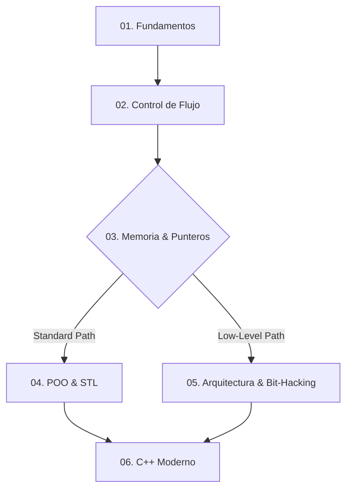

[](https://codespaces.new/)

## `< Tech Stack />`

[](https://isocpp.org/)
[](https://cmake.org/)

# Portafolio-C++

## `Ejecutar ejercicios en Codespaces (menu interactivo)`

En la terminal:

```sh
./menu.sh
```

Nota: `menu.sh` se proporciona con permisos ejecutables por defecto en Codespaces (y `.devcontainer` contiene un `postCreateCommand` como respaldo). Si por alguna razón no puede ejecutarlo, use `bash menu.sh`.

## `Propósito`
Portafolio-C++ es un repositorio público que recopila ejercicios en C++ organizados por niveles de aprendizaje. El objetivo es mostrar implementaciones pedagógicas y autocontenidas de problemas clásicos y modernos a medida que se avanza en el dominio del lenguaje.



## `< Roadmap :: Ejercicios />`

Leyenda
[x] Completado
[ ] Pendiente

<details>
  <summary><h3><strong><code>01 :: Fundamentos</code></strong></h3></summary>

<div align="center">

| Status | Exercise | Topic | Source | Live Demo |
|---|---|---|---|---|
| [x] | Hola Mundo | `std::cout` | [View Code](./src/Nivel1_Fundamentos_Variables_ES_Condicionales/N1_01_HolaMundo.cpp) | [▶️ Run (GDB)](https://www.onlinegdb.com/) |
| [x] | Suma de dos números | `std::cin`, operadores | [View Code](./src/Nivel1_Fundamentos_Variables_ES_Condicionales/N1_02_Suma.cpp) | [▶️ Run (GDB)](https://www.onlinegdb.com/) |
| [x] | Tipos de datos | `sizeof` | [View Code](./src/Nivel1_Fundamentos_Variables_ES_Condicionales/N1_03_TiposDeDatos.cpp) | [▶️ Run (GDB)](https://www.onlinegdb.com/) |
| [x] | Intercambio de variables | swap con temporal | [View Code](./src/Nivel1_Fundamentos_Variables_ES_Condicionales/N1_04_Intercambio_Temporal.cpp) | [▶️ Run (GDB)](https://www.onlinegdb.com/) |
| [x] | Intercambio sin temporal | aritmética / XOR | [Aritmético](./src/Nivel1_Fundamentos_Variables_ES_Condicionales/N1_05_Intercambio_Aritmetico.cpp)<br/>[XOR](./src/Nivel1_Fundamentos_Variables_ES_Condicionales/N1_05_Intercambio_XOR.cpp) | [▶️ Run (GDB)](https://www.onlinegdb.com/) |
| [x] | Par o Impar | `%`, condicionales | [View Code](./src/Nivel1_Fundamentos_Variables_ES_Condicionales/N1_06_ParImpar.cpp) | [▶️ Run (GDB)](https://www.onlinegdb.com/) |
| [x] | Mayor de dos | comparación | [View Code](./src/Nivel1_Fundamentos_Variables_ES_Condicionales/N1_07_MayorDeDos.cpp) | [▶️ Run (GDB)](https://www.onlinegdb.com/) |
| [x] | Mayor de tres | comparación | [View Code](./src/Nivel1_Fundamentos_Variables_ES_Condicionales/N1_08_MayorDeTres.cpp) | [▶️ Run (GDB)](https://www.onlinegdb.com/) |
| [x] | Año bisiesto | lógica booleana | [View Code](./src/Nivel1_Fundamentos_Variables_ES_Condicionales/N1_09_AnioBisiesto.cpp) | [▶️ Run (GDB)](https://www.onlinegdb.com/) |
| [x] | Calculadora simple | `switch` | [View Code](./src/Nivel1_Fundamentos_Variables_ES_Condicionales/N1_10_Calculadora.cpp) | [▶️ Run (GDB)](https://www.onlinegdb.com/) |
| [x] | Área de un círculo | constantes, `double` | [View Code](./src/Nivel1_Fundamentos_Variables_ES_Condicionales/N1_11_AreaCirculo.cpp) | [▶️ Run (GDB)](https://www.onlinegdb.com/) |
| [x] | Conversor de temperatura | fórmulas | [View Code](./src/Nivel1_Fundamentos_Variables_ES_Condicionales/N1_12_Conversor.cpp) | [▶️ Run (GDB)](https://www.onlinegdb.com/) |
| [ ] | Verificar vocal | `char`, condicionales | [View Code](./src/Nivel1_Fundamentos_Variables_ES_Condicionales/N1_13_Verificar_vocal.cpp) | [▶️ Run (GDB)](https://www.onlinegdb.com/) |
| [ ] | Número positivo/negativo/cero | rangos | [View Code](./src/Nivel1_Fundamentos_Variables_ES_Condicionales/N1_14_Numero_positivo_negativo_cero.cpp) | [▶️ Run (GDB)](https://www.onlinegdb.com/) |
| [ ] | Días de la semana | `switch` / mapping | [View Code](./src/Nivel1_Fundamentos_Variables_ES_Condicionales/N1_15_Dias_de_la_semana.cpp) | [▶️ Run (GDB)](https://www.onlinegdb.com/) |
| [ ] | Cálculo de descuento | condiciones | [View Code](./src/Nivel1_Fundamentos_Variables_ES_Condicionales/N1_16_Calculo_de_descuento.cpp) | [▶️ Run (GDB)](https://www.onlinegdb.com/) |
| [ ] | Divisibilidad | operadores | [View Code](./src/Nivel1_Fundamentos_Variables_ES_Condicionales/N1_17_Divisibilidad.cpp) | [▶️ Run (GDB)](https://www.onlinegdb.com/) |
| [ ] | Ecuación cuadrática | $ax^2 + bx + c$ | [View Code](./src/Nivel1_Fundamentos_Variables_ES_Condicionales/N1_18_Ecuacion_cuadratica.cpp) | [▶️ Run (GDB)](https://www.onlinegdb.com/) |
| [ ] | ASCII | casts, tabla ASCII | [View Code](./src/Nivel1_Fundamentos_Variables_ES_Condicionales/N1_19_ASCII.cpp) | [▶️ Run (GDB)](https://www.onlinegdb.com/) |
| [ ] | Validación de edad | condicionales | [View Code](./src/Nivel1_Fundamentos_Variables_ES_Condicionales/N1_20_Validacion_de_edad.cpp) | [▶️ Run (GDB)](https://www.onlinegdb.com/) |

</div>

</details>

<details>
  <summary><h3><strong><code>02 :: Control de Flujo</code></strong></h3></summary>

<div align="center">

| Status | Exercise | Topic | Source | Live Demo |
|---|---|---|---|---|
| [ ] | Imprimir 1 al 100 | `for` | [View Code](./src/Nivel2_ControlDeFlujo_Y_Arreglos_Bucles_Arrays_Strings_Basicos/N2_01_Imprimir_1_al_100.cpp) | [▶️ Run (GDB)](https://www.onlinegdb.com/) |
| [ ] | Suma de naturales | acumulación | [View Code](./src/Nivel2_ControlDeFlujo_Y_Arreglos_Bucles_Arrays_Strings_Basicos/N2_02_Suma_de_naturales.cpp) | [▶️ Run (GDB)](https://www.onlinegdb.com/) |
| [ ] | Factorial | $n!$ | [View Code](./src/Nivel2_ControlDeFlujo_Y_Arreglos_Bucles_Arrays_Strings_Basicos/N2_03_Factorial.cpp) | [▶️ Run (GDB)](https://www.onlinegdb.com/) |
| [ ] | Tabla de multiplicar | loops | [View Code](./src/Nivel2_ControlDeFlujo_Y_Arreglos_Bucles_Arrays_Strings_Basicos/N2_04_Tabla_de_multiplicar.cpp) | [▶️ Run (GDB)](https://www.onlinegdb.com/) |
| [ ] | Serie Fibonacci | iteración | [View Code](./src/Nivel2_ControlDeFlujo_Y_Arreglos_Bucles_Arrays_Strings_Basicos/N2_05_Serie_Fibonacci.cpp) | [▶️ Run (GDB)](https://www.onlinegdb.com/) |
| [ ] | Invertir número | aritmética entera | [View Code](./src/Nivel2_ControlDeFlujo_Y_Arreglos_Bucles_Arrays_Strings_Basicos/N2_06_Invertir_numero.cpp) | [▶️ Run (GDB)](https://www.onlinegdb.com/) |
| [ ] | Suma de dígitos | `%` y `/` | [View Code](./src/Nivel2_ControlDeFlujo_Y_Arreglos_Bucles_Arrays_Strings_Basicos/N2_07_Suma_de_digitos.cpp) | [▶️ Run (GDB)](https://www.onlinegdb.com/) |
| [ ] | Números Primos | primalidad | [View Code](./src/Nivel2_ControlDeFlujo_Y_Arreglos_Bucles_Arrays_Strings_Basicos/N2_08_Numeros_primos.cpp) | [▶️ Run (GDB)](https://www.onlinegdb.com/) |
| [ ] | Primos en rango | loops | [View Code](./src/Nivel2_ControlDeFlujo_Y_Arreglos_Bucles_Arrays_Strings_Basicos/N2_09_Primos_en_rango.cpp) | [▶️ Run (GDB)](https://www.onlinegdb.com/) |
| [ ] | Patrón de asteriscos | patrones | [View Code](./src/Nivel2_ControlDeFlujo_Y_Arreglos_Bucles_Arrays_Strings_Basicos/N2_10_Patron_de_asteriscos.cpp) | [▶️ Run (GDB)](https://www.onlinegdb.com/) |
| [ ] | Pirámide | patrones | [View Code](./src/Nivel2_ControlDeFlujo_Y_Arreglos_Bucles_Arrays_Strings_Basicos/N2_11_Piramide.cpp) | [▶️ Run (GDB)](https://www.onlinegdb.com/) |
| [ ] | Máximo en Array | arrays | [View Code](./src/Nivel2_ControlDeFlujo_Y_Arreglos_Bucles_Arrays_Strings_Basicos/N2_12_Maximo_en_array.cpp) | [▶️ Run (GDB)](https://www.onlinegdb.com/) |
| [ ] | Mínimo en Array | arrays | [View Code](./src/Nivel2_ControlDeFlujo_Y_Arreglos_Bucles_Arrays_Strings_Basicos/N2_13_Minimo_en_array.cpp) | [▶️ Run (GDB)](https://www.onlinegdb.com/) |
| [ ] | Promedio | media aritmética | [View Code](./src/Nivel2_ControlDeFlujo_Y_Arreglos_Bucles_Arrays_Strings_Basicos/N2_14_Promedio.cpp) | [▶️ Run (GDB)](https://www.onlinegdb.com/) |
| [ ] | Buscar elemento | búsqueda lineal | [View Code](./src/Nivel2_ControlDeFlujo_Y_Arreglos_Bucles_Arrays_Strings_Basicos/N2_15_Buscar_elemento.cpp) | [▶️ Run (GDB)](https://www.onlinegdb.com/) |
| [ ] | Contar ocurrencias | conteo | [View Code](./src/Nivel2_ControlDeFlujo_Y_Arreglos_Bucles_Arrays_Strings_Basicos/N2_16_Contar_ocurrencias.cpp) | [▶️ Run (GDB)](https://www.onlinegdb.com/) |
| [ ] | Invertir Array | in-place | [View Code](./src/Nivel2_ControlDeFlujo_Y_Arreglos_Bucles_Arrays_Strings_Basicos/N2_17_Invertir_array.cpp) | [▶️ Run (GDB)](https://www.onlinegdb.com/) |
| [ ] | Palíndromo (String) | strings | [View Code](./src/Nivel2_ControlDeFlujo_Y_Arreglos_Bucles_Arrays_Strings_Basicos/N2_18_Palindromo_string.cpp) | [▶️ Run (GDB)](https://www.onlinegdb.com/) |
| [ ] | Contar vocales (String) | strings | [View Code](./src/Nivel2_ControlDeFlujo_Y_Arreglos_Bucles_Arrays_Strings_Basicos/N2_19_Contar_vocales_string.cpp) | [▶️ Run (GDB)](https://www.onlinegdb.com/) |
| [ ] | Concatenar cadenas | strings | [View Code](./src/Nivel2_ControlDeFlujo_Y_Arreglos_Bucles_Arrays_Strings_Basicos/N2_20_Concatenar_cadenas.cpp) | [▶️ Run (GDB)](https://www.onlinegdb.com/) |

</div>

</details>

<details>
  <summary><h3><strong><code>03 :: Memoria & Punteros</code></strong></h3></summary>

| Status | Exercise | Topic | Source | Live Demo |
|---|---|---|---|---|
| [ ] | Función Potencia | $x^y$ sin `pow()` | [View Code](./src/Nivel3_Modularidad_Y_Memoria_Funciones_Punteros_Recursividad/N3_01_Funcion_potencia.cpp) | [▶️ Run (GDB)](https://www.onlinegdb.com/) |
| [ ] | Paso por Valor vs Referencia | `&` | [View Code](./src/Nivel3_Modularidad_Y_Memoria_Funciones_Punteros_Recursividad/N3_02_Paso_por_valor_vs_referencia.cpp) | [▶️ Run (GDB)](https://www.onlinegdb.com/) |
| [ ] | Punteros Básicos | punteros | [View Code](./src/Nivel3_Modularidad_Y_Memoria_Funciones_Punteros_Recursividad/N3_03_Punteros_basicos.cpp) | [▶️ Run (GDB)](https://www.onlinegdb.com/) |
| [ ] | Aritmética de Punteros | arrays + punteros | [View Code](./src/Nivel3_Modularidad_Y_Memoria_Funciones_Punteros_Recursividad/N3_04_Aritmetica_de_punteros.cpp) | [▶️ Run (GDB)](https://www.onlinegdb.com/) |
| [ ] | Swap con Punteros | `int*` | [View Code](./src/Nivel3_Modularidad_Y_Memoria_Funciones_Punteros_Recursividad/N3_05_Swap_con_punteros.cpp) | [▶️ Run (GDB)](https://www.onlinegdb.com/) |
| [ ] | Factorial Recursivo | recursión | [View Code](./src/Nivel3_Modularidad_Y_Memoria_Funciones_Punteros_Recursividad/N3_06_Factorial_recursivo.cpp) | [▶️ Run (GDB)](https://www.onlinegdb.com/) |
| [ ] | Fibonacci Recursivo | recursión | [View Code](./src/Nivel3_Modularidad_Y_Memoria_Funciones_Punteros_Recursividad/N3_07_Fibonacci_recursivo.cpp) | [▶️ Run (GDB)](https://www.onlinegdb.com/) |
| [ ] | Torres de Hanoi | recursión | [View Code](./src/Nivel3_Modularidad_Y_Memoria_Funciones_Punteros_Recursividad/N3_08_Torres_de_Hanoi.cpp) | [▶️ Run (GDB)](https://www.onlinegdb.com/) |
| [ ] | MCD (Euclides) | recursión | [View Code](./src/Nivel3_Modularidad_Y_Memoria_Funciones_Punteros_Recursividad/N3_09_MCD_Euclides.cpp) | [▶️ Run (GDB)](https://www.onlinegdb.com/) |
| [ ] | Suma de Array Recursiva | recursión | [View Code](./src/Nivel3_Modularidad_Y_Memoria_Funciones_Punteros_Recursividad/N3_10_Suma_de_array_recursiva.cpp) | [▶️ Run (GDB)](https://www.onlinegdb.com/) |
| [ ] | Longitud de cadena | punteros | [View Code](./src/Nivel3_Modularidad_Y_Memoria_Funciones_Punteros_Recursividad/N3_11_Longitud_de_cadena.cpp) | [▶️ Run (GDB)](https://www.onlinegdb.com/) |
| [ ] | Copiar cadena | punteros | [View Code](./src/Nivel3_Modularidad_Y_Memoria_Funciones_Punteros_Recursividad/N3_12_Copiar_cadena.cpp) | [▶️ Run (GDB)](https://www.onlinegdb.com/) |
| [ ] | Memoria Dinámica (new/delete) | heap | [View Code](./src/Nivel3_Modularidad_Y_Memoria_Funciones_Punteros_Recursividad/N3_13_Memoria_dinamica_new_delete.cpp) | [▶️ Run (GDB)](https://www.onlinegdb.com/) |
| [ ] | Matriz Dinámica | `T**` | [View Code](./src/Nivel3_Modularidad_Y_Memoria_Funciones_Punteros_Recursividad/N3_14_Matriz_dinamica.cpp) | [▶️ Run (GDB)](https://www.onlinegdb.com/) |
| [ ] | Estructuras (struct) | `struct` | [View Code](./src/Nivel3_Modularidad_Y_Memoria_Funciones_Punteros_Recursividad/N3_15_Estructuras_struct.cpp) | [▶️ Run (GDB)](https://www.onlinegdb.com/) |
| [ ] | Array de Structs | colección | [View Code](./src/Nivel3_Modularidad_Y_Memoria_Funciones_Punteros_Recursividad/N3_16_Array_de_structs.cpp) | [▶️ Run (GDB)](https://www.onlinegdb.com/) |
| [ ] | Puntero a Struct | `->` | [View Code](./src/Nivel3_Modularidad_Y_Memoria_Funciones_Punteros_Recursividad/N3_17_Puntero_a_struct.cpp) | [▶️ Run (GDB)](https://www.onlinegdb.com/) |
| [ ] | Punteros a Funciones | callbacks | [View Code](./src/Nivel3_Modularidad_Y_Memoria_Funciones_Punteros_Recursividad/N3_18_Punteros_a_funciones.cpp) | [▶️ Run (GDB)](https://www.onlinegdb.com/) |
| [ ] | Bubble Sort | sorting | [View Code](./src/Nivel3_Modularidad_Y_Memoria_Funciones_Punteros_Recursividad/N3_19_Bubble_sort.cpp) | [▶️ Run (GDB)](https://www.onlinegdb.com/) |
| [ ] | Búsqueda Binaria | búsqueda | [View Code](./src/Nivel3_Modularidad_Y_Memoria_Funciones_Punteros_Recursividad/N3_20_Busqueda_binaria.cpp) | [▶️ Run (GDB)](https://www.onlinegdb.com/) |

</details>

<details>
  <summary><h3><strong><code>04 :: POO & STL</code></strong></h3></summary>

<div align="center">

| Status | Exercise | Topic | Source | Live Demo |
|---|---|---|---|---|
| [ ] | Clase Rectángulo | clases | [View Code](./src/Nivel4_POO_Y_STL/N4_01_Clase_rectangulo.cpp) | [▶️ Run (GDB)](https://www.onlinegdb.com/) |
| [ ] | Encapsulamiento | getters/setters | [View Code](./src/Nivel4_POO_Y_STL/N4_02_Encapsulamiento.cpp) | [▶️ Run (GDB)](https://www.onlinegdb.com/) |
| [ ] | Constructores y Destructores | lifetime | [View Code](./src/Nivel4_POO_Y_STL/N4_03_Constructores_y_destructores.cpp) | [▶️ Run (GDB)](https://www.onlinegdb.com/) |
| [ ] | Sobrecarga de Métodos | overload | [View Code](./src/Nivel4_POO_Y_STL/N4_04_Sobrecarga_de_metodos.cpp) | [▶️ Run (GDB)](https://www.onlinegdb.com/) |
| [ ] | Herencia Simple | herencia | [View Code](./src/Nivel4_POO_Y_STL/N4_05_Herencia_simple.cpp) | [▶️ Run (GDB)](https://www.onlinegdb.com/) |
| [ ] | Polimorfismo | `virtual` | [View Code](./src/Nivel4_POO_Y_STL/N4_06_Polimorfismo.cpp) | [▶️ Run (GDB)](https://www.onlinegdb.com/) |
| [ ] | Clases Abstractas | `= 0` | [View Code](./src/Nivel4_POO_Y_STL/N4_07_Clases_abstractas.cpp) | [▶️ Run (GDB)](https://www.onlinegdb.com/) |
| [ ] | Sobrecarga de Operadores | operator overloading | [View Code](./src/Nivel4_POO_Y_STL/N4_08_Sobrecarga_de_operadores.cpp) | [▶️ Run (GDB)](https://www.onlinegdb.com/) |
| [ ] | Miembros Estáticos | `static` | [View Code](./src/Nivel4_POO_Y_STL/N4_09_Miembros_estaticos.cpp) | [▶️ Run (GDB)](https://www.onlinegdb.com/) |
| [ ] | Composición | composición | [View Code](./src/Nivel4_POO_Y_STL/N4_10_Composicion.cpp) | [▶️ Run (GDB)](https://www.onlinegdb.com/) |
| [ ] | Vector (STL) | `std::vector` | [View Code](./src/Nivel4_POO_Y_STL/N4_11_Vector_STL.cpp) | [▶️ Run (GDB)](https://www.onlinegdb.com/) |
| [ ] | Map (STL) | `std::map` | [View Code](./src/Nivel4_POO_Y_STL/N4_12_Map_STL.cpp) | [▶️ Run (GDB)](https://www.onlinegdb.com/) |
| [ ] | Set (STL) | `std::set` | [View Code](./src/Nivel4_POO_Y_STL/N4_13_Set_STL.cpp) | [▶️ Run (GDB)](https://www.onlinegdb.com/) |
| [ ] | List (STL) | `std::list` | [View Code](./src/Nivel4_POO_Y_STL/N4_14_List_STL.cpp) | [▶️ Run (GDB)](https://www.onlinegdb.com/) |
| [ ] | Iteradores | iterators | [View Code](./src/Nivel4_POO_Y_STL/N4_15_Iteradores.cpp) | [▶️ Run (GDB)](https://www.onlinegdb.com/) |
| [ ] | Algoritmos STL | `std::sort`/`find` | [View Code](./src/Nivel4_POO_Y_STL/N4_16_Algoritmos_STL.cpp) | [▶️ Run (GDB)](https://www.onlinegdb.com/) |
| [ ] | Archivos de Texto (Lectura) | `ifstream` | [View Code](./src/Nivel4_POO_Y_STL/N4_17_Archivos_texto_lectura.cpp) | [▶️ Run (GDB)](https://www.onlinegdb.com/) |
| [ ] | Archivos de Texto (Escritura) | `ofstream` | [View Code](./src/Nivel4_POO_Y_STL/N4_18_Archivos_texto_escritura.cpp) | [▶️ Run (GDB)](https://www.onlinegdb.com/) |
| [ ] | Archivos Binarios | `fstream` binary | [View Code](./src/Nivel4_POO_Y_STL/N4_19_Archivos_binarios.cpp) | [▶️ Run (GDB)](https://www.onlinegdb.com/) |
| [ ] | Manejo de Excepciones | `try/catch` | [View Code](./src/Nivel4_POO_Y_STL/N4_20_Manejo_de_excepciones.cpp) | [▶️ Run (GDB)](https://www.onlinegdb.com/) |

</div>

</details>

<details>
  <summary><h3><strong><code>05 :: C++ Moderno</code></strong></h3></summary>

<div align="center">

| Status | Exercise | Topic | Source | Live Demo |
|---|---|---|---|---|
| [ ] | Templates de Función | templates | [View Code](./src/Nivel5_CPP_Moderno_Y_Avanzado_CPP11_14_17_20/N5_01_Templates_de_funcion.cpp) | [▶️ Run (GDB)](https://www.onlinegdb.com/) |
| [ ] | Templates de Clase | templates | [View Code](./src/Nivel5_CPP_Moderno_Y_Avanzado_CPP11_14_17_20/N5_02_Templates_de_clase.cpp) | [▶️ Run (GDB)](https://www.onlinegdb.com/) |
| [ ] | Smart Pointers (unique_ptr) | RAII | [View Code](./src/Nivel5_CPP_Moderno_Y_Avanzado_CPP11_14_17_20/N5_03_Smart_pointers_unique_ptr.cpp) | [▶️ Run (GDB)](https://www.onlinegdb.com/) |
| [ ] | Smart Pointers (shared_ptr) | ownership | [View Code](./src/Nivel5_CPP_Moderno_Y_Avanzado_CPP11_14_17_20/N5_04_Smart_pointers_shared_ptr.cpp) | [▶️ Run (GDB)](https://www.onlinegdb.com/) |
| [ ] | Expresiones Lambda | lambdas | [View Code](./src/Nivel5_CPP_Moderno_Y_Avanzado_CPP11_14_17_20/N5_05_Expresiones_lambda.cpp) | [▶️ Run (GDB)](https://www.onlinegdb.com/) |
| [ ] | Move Semantics | `&&` | [View Code](./src/Nivel5_CPP_Moderno_Y_Avanzado_CPP11_14_17_20/N5_06_Move_semantics.cpp) | [▶️ Run (GDB)](https://www.onlinegdb.com/) |
| [ ] | Linked List Manual | punteros | [View Code](./src/Nivel5_CPP_Moderno_Y_Avanzado_CPP11_14_17_20/N5_07_Linked_list_manual.cpp) | [▶️ Run (GDB)](https://www.onlinegdb.com/) |
| [ ] | Stack Manual | LIFO | [View Code](./src/Nivel5_CPP_Moderno_Y_Avanzado_CPP11_14_17_20/N5_08_Stack_manual.cpp) | [▶️ Run (GDB)](https://www.onlinegdb.com/) |
| [ ] | Queue Manual | FIFO | [View Code](./src/Nivel5_CPP_Moderno_Y_Avanzado_CPP11_14_17_20/N5_09_Queue_manual.cpp) | [▶️ Run (GDB)](https://www.onlinegdb.com/) |
| [ ] | Árbol Binario de Búsqueda (BST) | árboles | [View Code](./src/Nivel5_CPP_Moderno_Y_Avanzado_CPP11_14_17_20/N5_10_BST.cpp) | [▶️ Run (GDB)](https://www.onlinegdb.com/) |
| [ ] | Multithreading Básico | `std::thread` | [View Code](./src/Nivel5_CPP_Moderno_Y_Avanzado_CPP11_14_17_20/N5_11_Multithreading_basico.cpp) | [▶️ Run (GDB)](https://www.onlinegdb.com/) |
| [ ] | Mutex y Race Conditions | `std::mutex` | [View Code](./src/Nivel5_CPP_Moderno_Y_Avanzado_CPP11_14_17_20/N5_12_Mutex_y_race_conditions.cpp) | [▶️ Run (GDB)](https://www.onlinegdb.com/) |
| [ ] | Producer-Consumer | `condition_variable` | [View Code](./src/Nivel5_CPP_Moderno_Y_Avanzado_CPP11_14_17_20/N5_13_Producer_consumer.cpp) | [▶️ Run (GDB)](https://www.onlinegdb.com/) |
| [ ] | Singleton Pattern | thread-safe | [View Code](./src/Nivel5_CPP_Moderno_Y_Avanzado_CPP11_14_17_20/N5_14_Singleton_pattern.cpp) | [▶️ Run (GDB)](https://www.onlinegdb.com/) |
| [ ] | Factory Pattern | patrones | [View Code](./src/Nivel5_CPP_Moderno_Y_Avanzado_CPP11_14_17_20/N5_15_Factory_pattern.cpp) | [▶️ Run (GDB)](https://www.onlinegdb.com/) |
| [ ] | Bit Manipulation | bitwise | [View Code](./src/Nivel5_CPP_Moderno_Y_Avanzado_CPP11_14_17_20/N5_16_Bit_manipulation_potencia_de_dos.cpp) | [▶️ Run (GDB)](https://www.onlinegdb.com/) |
| [ ] | RAII | recursos | [View Code](./src/Nivel5_CPP_Moderno_Y_Avanzado_CPP11_14_17_20/N5_17_RAII.cpp) | [▶️ Run (GDB)](https://www.onlinegdb.com/) |
| [ ] | Algoritmo de Dijkstra | grafos | [View Code](./src/Nivel5_CPP_Moderno_Y_Avanzado_CPP11_14_17_20/N5_18_Algoritmo_de_Dijkstra.cpp) | [▶️ Run (GDB)](https://www.onlinegdb.com/) |
| [ ] | Parser JSON simple | parsing | [View Code](./src/Nivel5_CPP_Moderno_Y_Avanzado_CPP11_14_17_20/N5_19_Parser_JSON_simple.cpp) | [▶️ Run (GDB)](https://www.onlinegdb.com/) |
| [ ] | Socket Programming Básico | networking | [View Code](./src/Nivel5_CPP_Moderno_Y_Avanzado_CPP11_14_17_20/N5_20_Socket_programming_basico.cpp) | [▶️ Run (GDB)](https://www.onlinegdb.com/) |

</div>

</details>


<details>
  <summary><h3><strong><code>Architecture :: Bit-Hacking</code></strong></h3></summary>

<div align="center">

| Status | Challenge | Constraint | Complexity $O(n)$ | Live Demo |
|---|---|---|---|---|
| [ ] | Valor Absoluto (Abs) — [View Code](./src/Arquitectura/Nivel1_Fundamentos_Bitwise_ComplementoA2/A_Nivel1_01_Valor_Absoluto_Abs.cpp) | sin `if`, sin `abs()`, sin `?:` | $O(1)$ | [▶️ Run (GDB)](https://www.onlinegdb.com/) |
| [ ] | Verificación de Signos Opuestos — [View Code](./src/Arquitectura/Nivel1_Fundamentos_Bitwise_ComplementoA2/A_Nivel1_02_Verificacion_de_signos_opuestos.cpp) | sin `<` / `>` | $O(1)$ | [▶️ Run (GDB)](https://www.onlinegdb.com/) |
| [ ] | Es Potencia de Dos — [View Code](./src/Arquitectura/Nivel1_Fundamentos_Bitwise_ComplementoA2/A_Nivel1_03_Es_potencia_de_dos.cpp) | sin bucles, sin condicionales | $O(1)$ | [▶️ Run (GDB)](https://www.onlinegdb.com/) |
| [ ] | Multiplicación por 7 rápida — [View Code](./src/Arquitectura/Nivel1_Fundamentos_Bitwise_ComplementoA2/A_Nivel1_04_Multiplicacion_por_7_rapida.cpp) | sin `*`, solo `<<` y `-` | $O(1)$ | [▶️ Run (GDB)](https://www.onlinegdb.com/) |
| [ ] | Set condicional (Conditional Move) — [View Code](./src/Arquitectura/Nivel1_Fundamentos_Bitwise_ComplementoA2/A_Nivel1_05_Set_condicional.cpp) | sin `if`, sin `?:` | $O(1)$ | [▶️ Run (GDB)](https://www.onlinegdb.com/) |
| [ ] | Suma Condicional de Arreglo — [View Code](./src/Arquitectura/Nivel2_ControlDeFlujo_Y_Arreglos_ProcesamientoEnLote_Y_Mascaras/A_Nivel2_01_Suma_condicional_de_arreglo.cpp) | sin `if` por elemento | $O(n)$ | [▶️ Run (GDB)](https://www.onlinegdb.com/) |
| [ ] | Conversión a Minúsculas — [View Code](./src/Arquitectura/Nivel2_ControlDeFlujo_Y_Arreglos_ProcesamientoEnLote_Y_Mascaras/A_Nivel2_02_Conversion_a_minusculas.cpp) | sin `if` de rangos | $O(n)$ | [▶️ Run (GDB)](https://www.onlinegdb.com/) |
| [ ] | Contador de Bits (Hamming Weight) — [View Code](./src/Arquitectura/Nivel2_ControlDeFlujo_Y_Arreglos_ProcesamientoEnLote_Y_Mascaras/A_Nivel2_03_Contador_de_bits.cpp) | entero 32-bit | $O(1)$ | [▶️ Run (GDB)](https://www.onlinegdb.com/) |
| [ ] | Ring Buffer Index — [View Code](./src/Arquitectura/Nivel2_ControlDeFlujo_Y_Arreglos_ProcesamientoEnLote_Y_Mascaras/A_Nivel2_04_Ring_buffer_index.cpp) | `N` potencia de 2, sin `%` | $O(1)$ | [▶️ Run (GDB)](https://www.onlinegdb.com/) |
| [ ] | Encontrar elemento único (XOR) — [View Code](./src/Arquitectura/Nivel2_ControlDeFlujo_Y_Arreglos_ProcesamientoEnLote_Y_Mascaras/A_Nivel2_05_Encontrar_elemento_unico.cpp) | memoria $O(1)$ | $O(n)$ | [▶️ Run (GDB)](https://www.onlinegdb.com/) |
| [ ] | Alineación de Memoria (Align Up) — [View Code](./src/Arquitectura/Nivel3_Modularidad_Y_Memoria_Alineacion_Y_Punteros/A_Nivel3_01_Alineacion_de_memoria.cpp) | `A` potencia de 2, sin condicionales | $O(1)$ | [▶️ Run (GDB)](https://www.onlinegdb.com/) |
| [ ] | Intercambio XOR de Memoria — [View Code](./src/Arquitectura/Nivel3_Modularidad_Y_Memoria_Alineacion_Y_Punteros/A_Nivel3_02_Intercambio_XOR_de_memoria.cpp) | sin temporal | $O(1)$ | [▶️ Run (GDB)](https://www.onlinegdb.com/) |
| [ ] | Empaquetado de Color (RGB Packing) — [View Code](./src/Arquitectura/Nivel3_Modularidad_Y_Memoria_Alineacion_Y_Punteros/A_Nivel3_03_Empaquetado_de_color_RGB.cpp) | R,G,B en [0..255] | $O(1)$ | [▶️ Run (GDB)](https://www.onlinegdb.com/) |
| [ ] | Saturación Aritmética (Clamp) — [View Code](./src/Arquitectura/Nivel3_Modularidad_Y_Memoria_Alineacion_Y_Punteros/A_Nivel3_04_Saturacion_aritmetica.cpp) | sin `if` | $O(1)$ | [▶️ Run (GDB)](https://www.onlinegdb.com/) |
| [ ] | Detección de Endianness — [View Code](./src/Arquitectura/Nivel3_Modularidad_Y_Memoria_Alineacion_Y_Punteros/A_Nivel3_05_Deteccion_de_endianness.cpp) | inspección de memoria | $O(1)$ | [▶️ Run (GDB)](https://www.onlinegdb.com/) |
| [ ] | Clase BitFlag Eficiente — [View Code](./src/Arquitectura/Nivel4_Objetos_Y_Algoritmos_Avanzados_Abstraccion_Sin_Costo/A_Nivel4_01_Clase_BitFlag_eficiente.cpp) | hasta 64 flags en `uint64_t` | $O(1)$ | [▶️ Run (GDB)](https://www.onlinegdb.com/) |
| [ ] | Comparador Lexicográfico Branchless — [View Code](./src/Arquitectura/Nivel4_Objetos_Y_Algoritmos_Avanzados_Abstraccion_Sin_Costo/A_Nivel4_02_Comparador_lexicografico_branchless.cpp) | palabras 4 bytes | $O(1)$ | [▶️ Run (GDB)](https://www.onlinegdb.com/) |
| [ ] | UTF-8 Byte Length — [View Code](./src/Arquitectura/Nivel4_Objetos_Y_Algoritmos_Avanzados_Abstraccion_Sin_Costo/A_Nivel4_03_UTF_8_byte_length.cpp) | sin `switch`/`if` encadenados | $O(1)$ | [▶️ Run (GDB)](https://www.onlinegdb.com/) |
| [ ] | Filtro de Bloom — [View Code](./src/Arquitectura/Nivel4_Objetos_Y_Algoritmos_Avanzados_Abstraccion_Sin_Costo/A_Nivel4_04_Filtro_de_Bloom.cpp) | `k` hashes | $O(1)$ | [▶️ Run (GDB)](https://www.onlinegdb.com/) |
| [ ] | Min/Max Branchless en Vector — [View Code](./src/Arquitectura/Nivel4_Objetos_Y_Algoritmos_Avanzados_Abstraccion_Sin_Costo/A_Nivel4_05_Minimo_maximo_branchless.cpp) | sin `if` en actualización | $O(n)$ | [▶️ Run (GDB)](https://www.onlinegdb.com/) |

</div>

</details>
