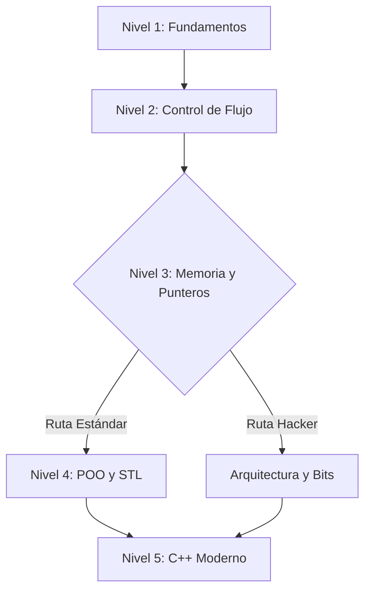

[](https://codespaces.new/)
[](./LICENSE)

# Portafolio-C++

## Ejecutar ejercicios en Codespaces (menu interactivo)

En la terminal:

```sh
./menu.sh
```

Nota: `menu.sh` se proporciona con permisos ejecutables por defecto en Codespaces (y `.devcontainer` contiene un `postCreateCommand` como respaldo). Si por alguna razón no puede ejecutarlo, use `bash menu.sh`.

Propósito
---------
Portafolio-C++ es un repositorio público que recopila ejercicios en C++ organizados por niveles de aprendizaje. El objetivo es mostrar implementaciones pedagógicas y autocontenidas de problemas clásicos y modernos a medida que se avanza en el dominio del lenguaje.



## Portafolio (interactivo)

**Leyenda**

- ✅: marcado como **[COMPLETADO]** en el listado original.
- 🚧: planificado (sin marca de completado).

<details open>
  <summary><h2>🟢 Nivel 1: Fundamentos</h2></summary>

| Estado | Ejercicio | Conceptos | Acción |
| --- | --- | --- | --- |
| ✅ | **Hola Mundo** | consola, `cout`, E/S | [📂 Ver Código](./src/Nivel1_Fundamentos_Variables_ES_Condicionales/N1_01_HolaMundo.cpp) |
| ✅ | **Suma de dos números** | `cin`, enteros, suma | [📂 Ver Código](./src/Nivel1_Fundamentos_Variables_ES_Condicionales/N1_02_Suma.cpp) |
| ✅ | **Tipos de datos** | `sizeof`, `int`, `float`, `double`, `char` | [📂 Ver Código](./src/Nivel1_Fundamentos_Variables_ES_Condicionales/N1_03_TiposDeDatos.cpp) |
| ✅ | **Intercambio de variables** | temporal, asignación, swap | [📂 Ver Código](./src/Nivel1_Fundamentos_Variables_ES_Condicionales/N1_04_Intercambio_Temporal.cpp) |
| ✅ | **Intercambio sin temporal** | aritmética, XOR, swap | [📂 Ver Código](./src/Nivel1_Fundamentos_Variables_ES_Condicionales/N1_05_Intercambio_Aritmetico.cpp) |
| ✅ | **Par o Impar** | `%`, paridad, condicional | [📂 Ver Código](./src/Nivel1_Fundamentos_Variables_ES_Condicionales/N1_06_ParImpar.cpp) |
| ✅ | **Mayor de dos** | comparación, `if`, máximo | [📂 Ver Código](./src/Nivel1_Fundamentos_Variables_ES_Condicionales/N1_07_MayorDeDos.cpp) |
| ✅ | **Mayor de tres** | comparación, `if`, máximo | [📂 Ver Código](./src/Nivel1_Fundamentos_Variables_ES_Condicionales/N1_08_MayorDeTres.cpp) |
| ✅ | **Año bisiesto** | divisibilidad, calendario, condicional | [📂 Ver Código](./src/Nivel1_Fundamentos_Variables_ES_Condicionales/N1_09_AnioBisiesto.cpp) |
| ✅ | **Calculadora simple** | `switch`, operadores, división | [📂 Ver Código](./src/Nivel1_Fundamentos_Variables_ES_Condicionales/N1_10_Calculadora.cpp) |
| ✅ | **Área de un círculo** | PI, radio, fórmula | [📂 Ver Código](./src/Nivel1_Fundamentos_Variables_ES_Condicionales/N1_11_AreaCirculo.cpp) |
| ✅ | **Conversor de temperatura** | Celsius, Fahrenheit, conversión | [📂 Ver Código](./src/Nivel1_Fundamentos_Variables_ES_Condicionales/N1_12_Conversor.cpp) |
| 🚧 | **Verificar vocal** | `char`, vocal/consonante, validación |  |
| 🚧 | **Número positivo/negativo/cero** | comparación, condicional, casos |  |
| 🚧 | **Días de la semana** | `switch`, mapeo 1-7, control de flujo |  |
| 🚧 | **Cálculo de descuento** | porcentaje, umbral, condicional |  |
| 🚧 | **Divisibilidad** | módulo, divisores 5 y 11 |  |
| 🚧 | **Ecuación cuadrática** | raíces, discriminante, $ax^2 + bx + c = 0$ |  |
| 🚧 | **ASCII** | tabla ASCII, `char`↔`int` |  |
| 🚧 | **Validación de edad** | comparación, rangos, mayor de edad |  |
</details>

<details>

| Estado | Ejercicio | Conceptos | Acción |
| --- | --- | --- | --- |
| 🚧 | **Imprimir 1 al 100** | `for`, iteración, salida |  |
| 🚧 | **Suma de naturales** | acumulador, bucles, series |  |
| 🚧 | **Factorial** | bucles, multiplicación, $n!$ |  |
| 🚧 | **Tabla de multiplicar** | bucles, producto, formato |  |
| 🚧 | **Serie Fibonacci** | recurrencia, bucles, secuencia |  |
| 🚧 | **Invertir número** | dígitos, `%`, `/` |  |
| 🚧 | **Suma de dígitos** | dígitos, `%`, acumulación |  |
| 🚧 | **Números Primos** | primalidad, divisores, bucles |  |
| 🚧 | **Primos en rango** | rangos, primalidad, bucles |  |
| 🚧 | **Patrón de asteriscos** | bucles anidados, impresión, patrones |  |
| 🚧 | **Pirámide** | bucles anidados, alineación, patrones |  |
| 🚧 | **Máximo en Array** | arreglos, recorrido, máximo |  |
| 🚧 | **Mínimo en Array** | arreglos, recorrido, mínimo |  |
| 🚧 | **Promedio** | suma, conteo, media |  |
| 🚧 | **Buscar elemento** | búsqueda lineal, arreglos, índice |  |
| 🚧 | **Contar ocurrencias** | frecuencia, arreglos, conteo |  |
| 🚧 | **Invertir Array** | in-place, índices, swap |  |
| 🚧 | **Palíndromo (String)** | strings, comparación, dos punteros |  |
| 🚧 | **Contar vocales (String)** | strings, conteo, caracteres |  |
| 🚧 | **Concatenar cadenas** | strings, buffers, concatenación manual |  |
</details>

<details>
  <summary><h2>🔴 Nivel 3: Memoria y Punteros</h2></summary>

| Estado | Ejercicio | Conceptos | Acción |
| --- | --- | --- | --- |
| 🚧 | **Función Potencia** | funciones, bucles, $x^y$ |  |
| 🚧 | **Paso por Valor vs Referencia** | referencia, copia, efectos laterales |  |
| 🚧 | **Punteros Básicos** | direcciones, `*`, `&` |  |
| 🚧 | **Aritmética de Punteros** | punteros, arrays, recorrido |  |
| 🚧 | **Swap con Punteros** | `int*`, dereferencia, swap |  |
| 🚧 | **Factorial Recursivo** | recursión, caso base, $n!$ |  |
| 🚧 | **Fibonacci Recursivo** | recursión, complejidad, memoización (conceptual) |  |
| 🚧 | **Torres de Hanoi** | recursión, descomposición, movimientos |  |
| 🚧 | **MCD (Euclides)** | recursión, módulo, gcd |  |
| 🚧 | **Suma de Array Recursiva** | recursión, arreglos, acumulación |  |
| 🚧 | **Longitud de cadena** | punteros, `strlen`, recorrido |  |
| 🚧 | **Copiar cadena** | punteros, `strcpy`, buffers |  |
| 🚧 | **Memoria Dinámica (new/delete)** | heap, `new[]`, `delete[]` |  |
| 🚧 | **Matriz Dinámica** | `**`, asignación, 2D |  |
| 🚧 | **Estructuras (struct)** | `struct`, campos, entrada/salida |  |
| 🚧 | **Array de Structs** | arreglos, `struct`, iteración |  |
| 🚧 | **Puntero a Struct** | `->`, punteros, acceso |  |
| 🚧 | **Punteros a Funciones** | callbacks, firmas, dispatch |  |
| 🚧 | **Bubble Sort** | ordenamiento, bucles, swap |  |
| 🚧 | **Búsqueda Binaria** | búsqueda, ordenado, iterativo/recursivo |  |
</details>

<details>
  <summary><h2>🔵 Nivel 4: POO y STL</h2></summary>

| Estado | Ejercicio | Conceptos | Acción |
| --- | --- | --- | --- |
| 🚧 | **Clase Rectángulo** | clases, métodos, área/perímetro |  |
| 🚧 | **Encapsulamiento** | `private`, `public`, getters/setters |  |
| 🚧 | **Constructores y Destructores** | RAII básico, ciclo de vida |  |
| 🚧 | **Sobrecarga de Métodos** | overloading, firmas, parámetros |  |
| 🚧 | **Herencia Simple** | herencia, `protected`, especialización |  |
| 🚧 | **Polimorfismo** | `virtual`, overrides, dispatch dinámico |  |
| 🚧 | **Clases Abstractas** | virtual puro, interfaz, `override` |  |
| 🚧 | **Sobrecarga de Operadores** | operadores, `operator+`, semántica |  |
| 🚧 | **Miembros Estáticos** | `static`, estado compartido, contador |  |
| 🚧 | **Composición** | composición, agregación, diseño |  |
| 🚧 | **Vector (STL)** | `std::vector`, iteración, mutación |  |
| 🚧 | **Map (STL)** | `std::map`, conteo, claves |  |
| 🚧 | **Set (STL)** | `std::set`, unicidad, filtrado |  |
| 🚧 | **List (STL)** | `std::list`, enlaces, iteradores |  |
| 🚧 | **Iteradores** | iteradores, `begin/end`, recorrido |  |
| 🚧 | **Algoritmos STL** | `std::sort`, `std::find`, `std::accumulate` |  |
| 🚧 | **Archivos de Texto (Lectura)** | `fstream`, lectura, líneas |  |
| 🚧 | **Archivos de Texto (Escritura)** | `fstream`, persistencia, formato |  |
| 🚧 | **Archivos Binarios** | `ios::binary`, serialización simple |  |
| 🚧 | **Manejo de Excepciones** | `try/catch`, `throw`, errores |  |
</details>

<details>
  <summary><h2>🟣 Nivel 5: C++ Moderno</h2></summary>

| Estado | Ejercicio | Conceptos | Acción |
| --- | --- | --- | --- |
| 🚧 | **Templates de Función** | plantillas, genéricos, deducción |  |
| 🚧 | **Templates de Clase** | `Pila<T>`, tipos, instanciación |  |
| 🚧 | **Smart Pointers (unique_ptr)** | ownership, RAII, `std::unique_ptr` |  |
| 🚧 | **Smart Pointers (shared_ptr)** | conteo de referencias, `std::shared_ptr` |  |
| 🚧 | **Expresiones Lambda** | lambdas, algoritmos, capturas |  |
| 🚧 | **Move Semantics** | rvalues, `&&`, movimiento |  |
| 🚧 | **Linked List Manual** | nodos, punteros, heap |  |
| 🚧 | **Stack Manual** | LIFO, nodos, punteros |  |
| 🚧 | **Queue Manual** | FIFO, nodos, punteros |  |
| 🚧 | **Árbol Binario de Búsqueda (BST)** | árboles, recorrido, orden |  |
| 🚧 | **Multithreading Básico** | `std::thread`, concurrencia, join |  |
| 🚧 | **Mutex y Race Conditions** | `std::mutex`, sección crítica |  |
| 🚧 | **Producer-Consumer** | `condition_variable`, sincronización |  |
| 🚧 | **Singleton Pattern** | patrón, thread-safe, estáticos |  |
| 🚧 | **Factory Pattern** | patrón, construcción, polimorfismo |  |
| 🚧 | **Bit Manipulation** | bits, potencia de 2, AND |  |
| 🚧 | **RAII** | recursos, wrappers, liberación |  |
| 🚧 | **Algoritmo de Dijkstra** | grafos, caminos mínimos, prioridad |  |
| 🚧 | **Parser JSON simple** | parsing, strings, estado |  |
| 🚧 | **Socket Programming Básico** | redes, TCP/UDP, echo server |  |
</details>

<details>
  <summary><h2>🧠 Arquitectura</h2></summary>

| Reto | Descripción | Restricción | Complejidad |
| --- | --- | --- | --- |
| **Valor Absoluto (Abs)** | Calcular $|x|$ sin ramificaciones (branchless) usando máscaras | sin `if`, sin `abs()`, sin operador ternario | O(1) |
| **Verificación de Signos Opuestos** | Detectar si `x` e `y` tienen signos opuestos usando MSB y XOR | sin comparaciones (`<`, `>`) | O(1) |
| **Es Potencia de Dos** | Determinar si `n` es potencia de 2 con `n & (n - 1)` | sin bucles, sin condicionales | O(1) |
| **Multiplicación por 7 rápida** | Multiplicar por 7 con desplazamientos y restas | sin `*` | O(1) |
| **Set condicional (Conditional Move)** | Seleccionar entre `valor_A` y `valor_B` usando máscara derivada de `condicion` | sin `if`, sin `?` (idealmente sin multiplicación) | O(1) |
| **Suma Condicional de Arreglo (Filter & Sum)** | Sumar solo pares sin ramificar | sin `if (arr[i] % 2 == 0)` | O(N) |
| **Conversión a Minúsculas (Lowercaser)** | Convertir ASCII mayúsculas→minúsculas usando el bit 5 | sin `if` para rangos | O(N) |
| **Contador de Bits (Hamming Weight)** | Contar bits en 1 (POPCNT conceptual) | — | O(1) (ancho de palabra) |
| **Intercambio circular (Ring Buffer Index)** | Incrementar índice en buffer potencia de 2 con máscara | sin `if`, sin `%` | O(1) |
| **Encontrar el elemento único (XOR Hash)** | Elemento no repetido usando acumulación XOR | memoria O(1) | O(N) |
| **Alineación de Memoria (Align Up)** | Alinear `ptr` a múltiplo de `A` con máscara | sin condicionales | O(1) |
| **Intercambio XOR de Memoria** | Intercambiar dos `int` con XOR vía punteros | sin variable temporal | O(1) |
| **Empaquetado de Color (RGB Packing)** | Empaquetar (R,G,B) en 32 bits con `<<` y `|` | — | O(1) |
| **Saturación Aritmética (Clamp)** | Suma saturada en 0-255 detectando overflow con bits | sin `if` | O(1) |
| **Detección de Endianness** | Detectar Little/Big Endian inspeccionando memoria | — | O(1) |
| **Clase "BitFlag" Eficiente** | 64 flags en un `uint64_t` con `set/clear/toggle/check` | — | O(1) |
| **Comparador Lexicográfico Branchless** | Comparar 4 letras empaquetadas en `uint32_t` | — | O(1) |
| **UTF-8 Byte Length** | Determinar longitud UTF-8 desde el primer byte | sin `switch` ni `if` encadenados | O(1) |
| **Filtro de Bloom (Bloom Filter)** | Estructura probabilística con múltiples hashes | — | O(k) |
| **Mínimo/Máximo Branchless en Vector** | Encontrar min/max sin `if` al iterar `std::vector<int>` | sin `if (val < min_val)` | O(N) |
</details>
